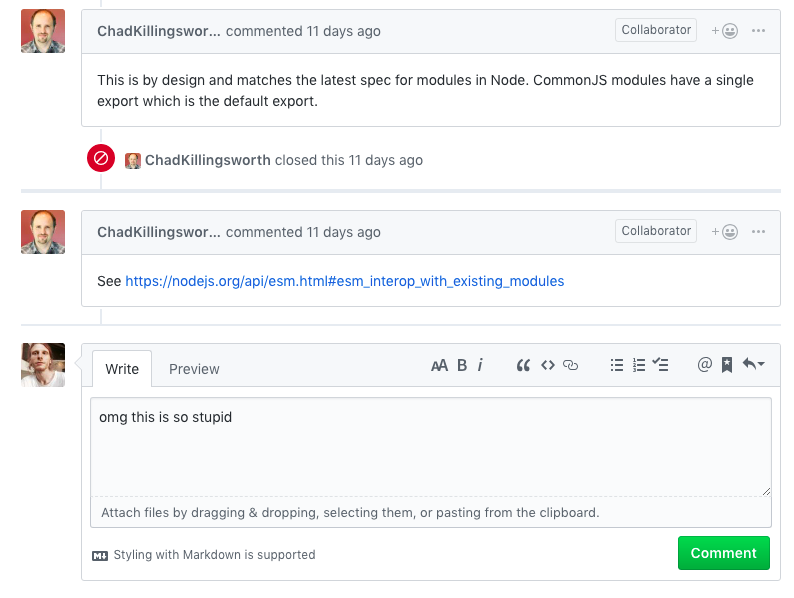
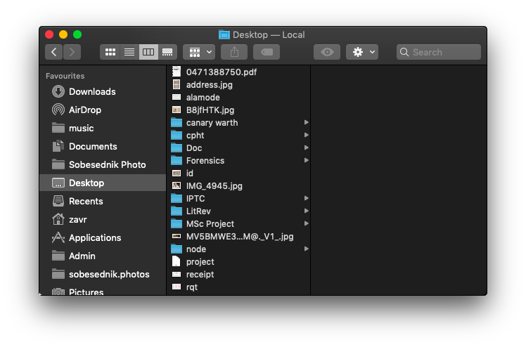
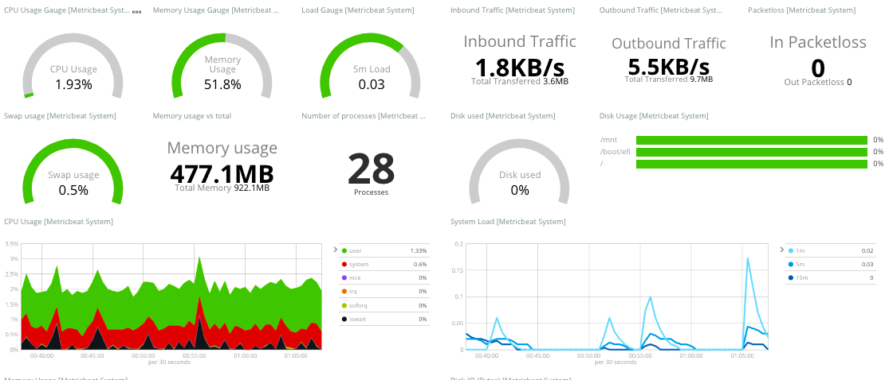
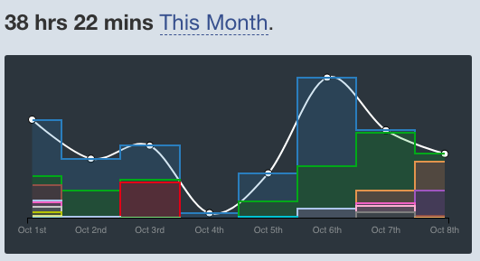
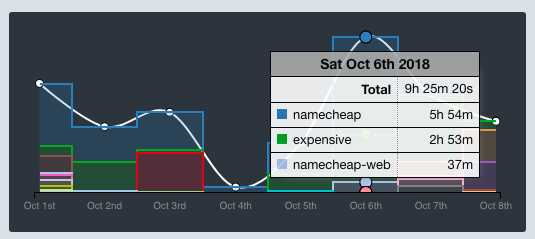
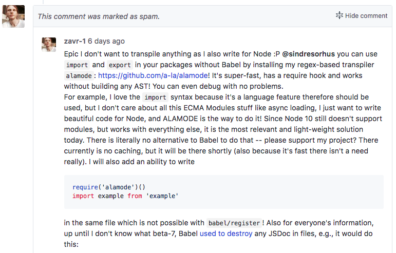

# daily-log

[](https://npmjs.org/package/daily-log)

`daily-log` is a collection of descriptions of work done each day.


<p align="center"><a href="#table-of-contents"></a></p>

## Table Of Contents

- [Table Of Contents](#table-of-contents)
- [today 3 Dec](#today-3-dec)
- [November](#november)
  * [12 Monday](#12-monday)
- [October](#october)
  * [30 Tuesday](#30-tuesday)
  * [26 - VS CODE CONFUSION](#26---vs-code-confusion)
  * [8-12 Planning](#8-12-planning)
  * [1-5 Planning](#1-5-planning)
- [TODO](#todo)
- [Archive](#archive)
  * [2018](#2018)
- [Copyright](#copyright)

<p align="center"><a href="#table-of-contents"></a></p>


## today 3 Dec

today is an interesting day because i had a day off and according to the studies, men and women perform better on the first day of the week. It means that I am anticipating the result of 2 of the latest bug reports in the google closure compiler repository: one when the dead code was not totally eliminated, but i predict that the outcome of that would be to pass a special flag indicating the entry module. The second issue with the google closure compiler is that the import from an ES6 module a common Js module (ie. `import { test } from 'test'` _FROM_ `module.exports.test = function testIO(){}`) does not produce the correct result such as the required method being imported.

 This is the question of interoperability of the module systems in the compiler and is described in its [wiki](https://github.com/google/closure-compiler/wiki/JS-Modules) which says

 > It is recommended that a module is imported using the method native to its type. CommonJS modules should be imported using require calls, goog.module should be imported with goog.require calls. However since ES6 import statements can only be used in ES6 modules, scripts and other module types can't use the import keyword.

 > It is possible to mix import statements, however this method is not generally recommended except for the case where importing an ES6 module into another script or module type.

 "please don't do it" therefore I think Google should seriously reconsider their terms because to be the modern start up like Art Deco, one has to write `import` statements, however the modules get transpiled before publishing, because Node.js does not understand the `import` syntax.


I don't know what they will say. I know that it is sure nice to sit in from of my computer again after a week+ of not attending any gadgets mostly. Needs must.

**UPD**

Apparently, it is not possible by design



God Bless ÀlaMode that I can transpile into common.js first and make stuff work, i.e., use the `build` directory that normally would have been published. On the other hand, I can check whether the compiler will even respect the standard where built-in modules can have named exports.

- [ ] Check whether closure accepts named built-in exports.

<p align="center"><a href="#table-of-contents"></a></p>

## November

In november, there is a competition entry to do.


### 12 Monday

Today I have updated the Windows virtual machine to have 2 GB of memory on a paid plan (£15/month) to be able to run _ElasticSearch_ smoothly. The performance of the machine shown by its responsiveness has improved. I also downloaded Kibana as a snapshot build locally. I tried to get its source code however it occupies a lot of disk space and cannot be sparsely downloaded (i.e., just the source folder that I wanted to compile with ÀLaMode instead of Babel). The `sparse.page` lambda function will allow to select git folders to download from GitHub. Moreover, Kibana's source contains _TypeScript_ code that also needs to be transpiled. I feel more confident now knowing how Kibana is developed and built.


In addition, I fixed a bug in the `@rqt/aqt` package where a dependency was missing, but did not show as such because it was installed as a dev dependency.

<p align="center"><a href="#table-of-contents"></a></p>

## October

The plan for this month is:

1. In the first week, complete the missing features for _NodeTools_, pull up the missing bits in functionality and documentation and some minor bugs (e.g., finish updating expensive, section breaks changing); work on the `mnpjs.org` to analyse packages; create a website `nodetools.co` with bare content, outline the roadmap to version two;
1. Then without timing, promote _NodeTools_ by getting in contact with multiple blogs / websites to ask them to write articles about it; write tutorials, content for the website.
1. Focus on research, prototyping, a video and pitch for _Demimonde_.

### 30 Tuesday

Today, I have updated the MacOS to version 10.14 because otherwise the `func` binaries from Microsoft needed to debug, test and deploy extensions to the Azure don't work. I didn't update for a long time but it is great to see that the laptop which is almost 10 years old works just fine, and it is really the only thing I need for work, without any new expensive gadgets. The new dark theme UI looks good although the non-dark theme is not supported as much.



Programmaticaly, I refactored `splendid` so that it is easier to understand and configure (pages configuration is now separate from the app configuration and can be written with `export` keywords).

Finally, I was able to set-up an ElasticSearch instance running on a Windows machine on Azure and install the metricbeats to send data from another VM to the first one. The data contains metrics data such as server load, and it achieve the long-standing want to run 2 VMs with Dokku apps on one and the ES on another.



**TODO**

- [ ] Write a tutorial explaining the benefits of 1-year free Azure subscription, Dokku and ElasticSearch, and how to make such a setup.
- [ ] Migrate the Windows server to the Dokku net so that it is private.
- [ ] Set up an Nginx proxy for Kibana.
- [ ] Send the log data from Nginx to ElasticSearch also.

<p align="center"><a href="#table-of-contents"></a></p>

### 26 - VS CODE CONFUSION

The JSDoc has to be commented out as well as the function to which it belongs otherwise the Vs Code will get confused.

---

Issue Type: <b>Bug</b>

so i dev like

```js
/**
 * Create a promise for a test function.
 * @param {function} fn function to execute
 * @return {Promise} A promise to execute function.
 */
// async function createTestPromise(fn) {
//   const res = await fn()
//   return res
// }
```

and then i dev more like
```js
/**
 * Asynchronously runs the test.
 * @returns {string}
 */
const run = (options) => {
  return 'ok'
}
```

but what i see is that the function returns `Promise.<any>` in the doc


and this is because the source code was commented out but before it there was jsdoc. Is this my fault?

VS Code version: Code - Insiders 1.28.0-insider (431ef9da3cf88a7e164f9d33bf62695e07c6c2a9, 2018-10-03T12:36:03.286Z)
OS version: Darwin x64 15.6.0

<details>
<summary>System Info</summary>

|Item|Value|
|---|---|
|CPUs|Intel(R) Core(TM)2 Duo CPU     P7350  @ 2.00GHz (2 x 2000)|
|GPU Status|2d_canvas: unavailable_software<br>checker_imaging: disabled_off<br>flash_3d: unavailable_software<br>flash_stage3d: unavailable_software<br>flash_stage3d_baseline: unavailable_software<br>gpu_compositing: unavailable_software<br>multiple_raster_threads: disabled_off<br>native_gpu_memory_buffers: unavailable_software<br>rasterization: unavailable_software<br>video_decode: unavailable_software<br>video_encode: unavailable_software<br>webgl: unavailable_off<br>webgl2: unavailable_off|
|Load (avg)|19, 13, 9|
|Memory (System)|8.00GB (0.32GB free)|
|Process Argv||
|Screen Reader|no|
|VM|0%|

</details><details><summary>Extensions (3)</summary>

Extension|Author (truncated)|Version
---|---|---
vscode-eslint|dba|1.6.1
code-spell-checker|str|1.6.10
vscode-wakatime|Wak|1.2.3


</details>
<p align="center"><a href="#table-of-contents"></a></p>

### 8-12 Planning

Last week, I didn't write much of the blog, as it was quite relaxed week. Despite that, by working on the weekend, I did manage to achieve 38 hours which is a full employment week. I focused on _Namecheap API_ implementation and documentation, and adding features to _Expensive_.





I also started to write a blog post on Medium about the _NodeTools_. There is an introduction, structure and the beginning of the section about why _TypeScript_ is not needed. I don't think I will keep it on Medium, but rather move it all to the content of the website.

<details>
  <summary>Show a rant</summary>

  I was quite frustrated when I commented on a topic by a person whom I dislike suggesting they use ÀLaMode, and it was then marked as spam:

  

  So he commented

  > @zavr-1 This is not the place to advertise your project. Try submitting to JavaScript Weekly newsletter and Reddit instead. For ES2015 module syntax, there's also esm.

  Gosh how I hate these people who take everything so seriously. So this particular guy made like I don't know how many packages and thinks he's a star, because all the unintelligent mob just uses his packages and thinks he is a god. There is a cult around this person just like around _Babel_ and _TypeScript_. Why be so hostile? Just say, "thanks dude", it's a community after all, where ideas are allowed to propagate. But ofc, because he's got this feeling of superiority due to all this fame, he needs to say that I am advertising. `esm` builds an AST tree just like any other transpiler. But that's fine I'm just upset that I let myself get involved there, I knew I disliked that person but I thought he might be different. Turned out to be exactly as I thought -- too much pathos and ego. It's just packages take a chill pill.

  On the other hand, it helped me to understand once and for all that I'm not making my software for anyone else, I am making it for myself. If anyone wants to use it, they are welcome to it. It is not my job going around advertising and wanting people to download it. In fact, I want as little number of people to use my packages because otherwise they will be too mainstream and I will become like that person, so much stuck up. I want my software to be grunge and underworld, and if before I cared that people would want to download it, now I know for sure that all that I was doing, was first and foremost, for myself. I will do a due diligence, make a site for _NodeTools_, post a few links, but that's it.
</details>

<p align="center"><a href="#table-of-contents"></a></p>

Therefore, this far the progress has been:

**PROGRESS**

- Completed 11% of the _NameCheap API_, documented [`getPricing`](https://github.com/rqt/namecheap#async-getpricingoptions-getpricing-pricing) method extensively.ß
- Implemented the price check in _Expensive_ before registration and automatic application of the coupon, added tests to it with _Zoroaster_ masks.
- Started writing the content for _NodeTools_.

**SMALL POSITIVES**

- Found a way to maintain separate readme on _NPM_ and _GitHub_, by having 2 files: `README` for _NPM_ and `README.md` for _GitHub_. This means that I can publish all documentation on _GitHub_ and place a link to it on _NPM_, because _NPM_ sucks.
- Added a password implementation to `reloquent` as well as confirmation questions.  
- Worked on _Completest_ prototype by setting up a _TypeScript_ server and writing types in JSDoc.
- Created a `forkFeed` (different from spoonfeed :P) to be able to send data to a child process via `stdin`, used it in _Zoroaster_.

<p align="center"><a href="#table-of-contents"></a></p>

The plan for this week is:

**ESSENTIAL**

- [ ] Create `@svag/terminal` to render terminal output with ANSI colors.
- [ ] Print the terminal output into the `@svag/terminal` in _Documentary_.
- [ ] Document _MNP_ and _Expensive_ with the terminal.
- [ ] Complete the first version of _Completest_.
- [ ] Move binary functions from _Documentary_ to _Typal_, add documentation.
- [ ] Create a scope for Documentary, move some rules there.
- [ ] Finish at least one item from last week's list.

<p align="center"><a href="#table-of-contents"></a></p>

### 1-5 Planning

Since last week, I have achieved what I wanted, that is to publish `@idio/core`, complete work on the `rqt` package by testing it with _IdioCore_, and then move the `namecheap` API from `expensive` to the `@rqt/namecheap-web`, where the whois fetching is also implemented.

The unexpected work came in when I wondered off in the direction of `MNP` and implemented the `GitHub` API package in `@rqt/github`, updated the tests and improved _Zoroaster_ to be able to pass inputs to the forked process. This was a longer-term goal and I'm happy I have completed it.

I have also setup VPN on the _Azure_ and it could be nice to make a video "How to get free VPN for a year" for a video blog.

This week's goals are to finish work on `expensive` and carry on with the `idio` separation into functional part, such as router and authentication unit. Gladly, this should be pretty easy as I have written the code already, it is just in different places.

There is still [the annoying bug](https://github.com/Microsoft/TypeScript/issues/26921) in _VS Code_ that makes the types not accessible.

**EXPENSIVE**

- [x] ~Create `@rqt/namecheap` standalone API package.~
- [x] ~Incorporate `@rqt/namecheap-web` and `@rqt/namecheap` into the package, refactor some code.~
- [ ] Implement a feature to set DNS.

**DOCUMENTARY**

- [ ] Create `@svag/terminal` to render terminal output.
- [ ] Print the terminal output into the `@svag/terminal`.

**ZOROASTER**

- [ ] Document using an example.
- [ ] Get inputs to fork from the input.
- [ ] Be able to access multiple properties of a mask as input.

**ALAMODE**

- [ ] Reverse markers to not cut out strings, add dynamic mode.
- [ ] Add a feature that would allow to require `alamode` in the same file as imports are written.

**DEVOPS**

- [ ] Move domains from Route 53 to `namecheap` to cut the costs.

**DAILY LOG**

- [x] ~Archive the September section.~

<p align="center"><a href="#table-of-contents"></a></p>

## TODO

- [ ] Add a new item to the todo list.

## Archive

### 2018

- [**September**](/archive/2018/9.md)

## Copyright

(c) [Art Deco][1] 2018

[1]: https://artdeco.bz

<p align="center"><a href="#table-of-contents"></a></p>