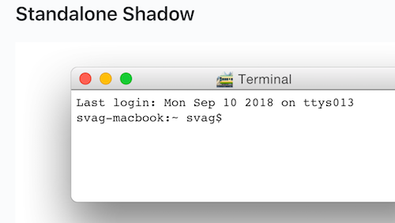

# daily-log

[](https://npmjs.org/package/daily-log)

`daily-log` is a collection of descriptions of work done each day.


## Table Of Contents

- [daily-log](#daily-log)
  * [Table Of Contents](#table-of-contents)
- [2018](#2018)
  * [September](#september)
    * [10 Monday](#10-monday)
    * [5 Wednesday](#5-wednesday)
    * [6 Thursday](#6-thursday)
  * [7 Friday](#7-friday)
  * [API](#api)
    * [`dailyLog(arg1: string, arg2?: boolean)`](#dailylogarg1-stringarg2-boolean-void)
  * [TODO](#todo)
  * [Copyright](#copyright)

# 2018


## September

### 10 Monday

When checking out the repository on the phone using mobile Safari, the image did not look sharp, because the filter made it into a raster and the quality was lost. The fix was to implement the shadow as a separate element. The problem did not arise on the desktop because images were not resized, however now with the example below it is clear that it could also have happened for larger images.

<table>
<thead>
 <tr>
  <th>
   Shadow On Window
  </th>
  <th>
   Standalone Shadow
  </th>
 </tr>
</thead>
<tbody>
  <tr>
   <td>
   
   </td>
   <td>
   
   </td>
  </tr>
</tbody>
</table>


There were a number of solutions that were thought about and tried out.

1. Using the CSS filter to create a shadow. The GitHub's sanitiser actually allows to have the `<style>` tag inside of the CSS. The box-shadow did not work, therefore the `filter: box-shadow()` had to be used. This worked fine on the browser, however did not work on the phone. As it turns out ([Why is filter(drop-shadow) causing my SVG to disappear in Safari?](https://stackoverflow.com/questions/36705323/why-is-filterdrop-shadow-causing-my-svg-to-disappear-in-safari)) there's a bug in older Safari which prevents the `-webkit-filter: drop-shadow` from working. Also interestingly, the sanitiser removes the `-moz-filter` property from the style.

    ```css
    svg {
      -webkit-filter: drop-shadow(0 22px 20px rgba(0, 0, 0, 0.5));
      -moz-filter: drop-shadow(0 22px 20px rgba(0, 0, 0, 0.5));
      -ms-filter: drop-shadow(0 22px 20px rgba(0, 0, 0, 0.5));
      filter: drop-shadow(0 22px 20px rgba(0, 0, 0, 0.5));
    }
    ```

1. Trying to emulate the gradient using the `radial-gradient`. This also does not work because the radial gradient cannot be rectangular as first thought. <br/>
   
<br/>There was a proposal ([Advanced Gradients for SVG](http://www.svgopen.org/2011/papers/18-Advanced_Gradients_for_SVG/)) by _Tavmjong Bah_ who is a developer / documenter (nice job) at Inkscape to include more complex gradients, and it looked really cool, however it never ended in the spec. Great work Tavmjong nevertheless ⭕ The article really shows how pro some people are.<br/>
    
<br/>Then I was considering applying a transform to the radial gradient, e.g., skewing or a matrix, however it's too complicated. Adding multiple shapes with its own gradient such as 4 circles on corners and rectangles inbetween seems complex as well, as there's no straight forward understanding as how they would look together.

1. Thinking about generating a single array of dots for the shadow, and filling with radial gradients between corners. This would make the filesize large, however is a possible solution.

1. Finally, the real solution which comes as an insight, is to only apply the shadow only to a separate element. Because the mobile browser would resize this one separately from the main window, the window would not be rasterised and would look fine. This proved to be true. 🎸

```svg
<g filter="url(#shadow)" transform="translate(55, 25)">
  <defs>
    <filter id="shadow" width="132%" height="180%" x="-16%" y="-19%">
      <feOffset dx="0" dy="25" in="SourceAlpha" result="so"/>
      <feGaussianBlur in="so" result="sb" stdDeviation="27.5"/>
      <feColorMatrix in="sb" result="sm" type="matrix" values="0 0 0 0 0   0 0 0 0 0   0 0 0 0 0  0 0 0 0.5 0"/>
      <!-- The merge is actually removed in the later version -->
      <feMerge>
        <feMergeNode in="sm"/>
        <feMergeNode in="SourceGraphic"/>
      </feMerge>
    </filter>
  </defs>
  <rect width="360" height="132" fill="white" rx="6" />
</g>
<g id="the-window">
  <!-- code for drawing the window -->
</g>
```

Time spent on the problem: ~3 hours.

**TODO**

1. Update `pedantry` to allow reverse reading of files (e.g., for this blog to start from the last day every time to show most recent items)
1. Update `pedantry` to parse the number before each file properly to prevent `11` going before `2`.
1. Update `svag` packages to use correct shadow without loosing quality.
1. ~~Add screenshots here from the iPhone to show poor quality.~~

<hr/>

The second part of the day was spent on implementing the shadow in the `@svag` org by updating the library as well as other packages. Some extra attributes could be omitted as they had a default value (e.g., gradient starting at `y=0%` and same for the line behind the toolbar, `x=0`).

The `@svag/lib` was improved in version 2 for better `createElement` signature which would take the name of the element as the first argument as it was compulsory anyway. The `rect` element was added and its documentation copied from the MDN website, however in future this process can be automated.

The `@svag` packages can benefit from `alamode` implementing a transform to parse `xml` in the same way as `jsx` parsing works. This means that the code could be transformed into a developer friendly version, e.g., instead of writing

```js
const rect = makeElement('rect', {
  width: 10,
  height: 20,
})
```

it would be possible to write

```jsx
const rect = <rect width={10} height={20}/>
```

which would be absolutely amazing if done with `alamode` (it was one of the goals of the regex transpiler project from the beginning). The source maps could be hard to implement but we love challenges.

The shadow was implemented, and even improved by removing merging it with the window element, so that the window which produces the shadow is transparent and only the shadow is visible. This ensures that it looks very clear on the mobiles.




### 5 Wednesday

Working on hiding error stack for the `restream` and starting to implement it in the `erotic`. Figuring out that Node.js [hides an async stack](https://github.com/nodejs/node/issues/11865) behind `<anonymous>`, but only if error was thrown after the first `await`.

```js
const after = async () => {
  await new Promise(r => setTimeout(r, 100))
  throw new Error('example error after await')
}

const before = async () => {
  throw new Error('example error before await')
}

(async () => {
  try {
    await before()
  } catch ({ stack }) {
    console.log(stack) // error stack is there
  }
})()

;(async () => {
  try {
    await after()
  } catch ({ stack }) {
    console.log('\n======\n')
    console.log(stack) // cuts at anonymous
  }
})()
```

```
Error: example error before await
    at before (/Users/zavr/adc/daily-log/example/promise.js:7:9)
    at /Users/zavr/adc/daily-log/example/promise.js:12:11
    at Object.<anonymous> (/Users/zavr/adc/daily-log/example/promise.js:16:3)
    at Module._compile (module.js:652:30)
    at Object.Module._extensions..js (module.js:663:10)
    at Module.load (module.js:565:32)
    at tryModuleLoad (module.js:505:12)
    at Function.Module._load (module.js:497:3)
    at Function.Module.runMain (module.js:693:10)
    at startup (bootstrap_node.js:191:16)

======

Error: example error after await
    at after (/Users/zavr/adc/daily-log/example/promise.js:3:9)
    at <anonymous>
```

- _Documentary_:
 + `v1.14`: refactor TOC, allow h1, detect underlined titles
 + `v1.13`: fork stderr
 + `v1.12`: replace require, start using masks
- _Restream_:
 + `v3.2`: brake and stack hiding.


**Future** Implement remembering the full async stack in `erotic`.

### 6 Thursday

The day started by continuing to find suitable packages to compile w/ `documentary`. [`json2svg`](https://www.npmjs.com/package/json2csv) looked good yesterday, however it had a screenshot of a PNG. Therefore it was decided to be a great feature for _Documentary_ to make screenshots of output from a terminal. The search revealed existence of [`ansi-to-svg`](https://github.com/F1LT3R/ansi-to-svg) which is not very popular, but amazing. To start off with, a [Yosemite UI Kit](https://www.sketchappsources.com/tag/yosemite.html) for Sketch was downloaded and the title bar exported as SVG.

Because the export was automatic and auto-generated, `Sketch` produced some output which could be simplified by hand. Updated the SVG file and made it a template for the `ansi-to-svg` which also required modifying the source code. Creating a `package.json` script for running tests on commit is hell and should not be allowed.

Finished off with a complete good-looking terminal template which could also be used as a stand-alone package. Allows to either have or not have shadows. Learnt some things about drawing SVGs such as creating paths (e.g., for rectangles with rounded corners) and blurs (along with cases when having to specify `x`, `y`, `width` and `height` for those). _MOVE TO_ in path definition reminded of year 5 logo-worlds (???).

✍️ Started the daily log 🎉!


**Future** Integrate the terminal generation into _Documentary_, make animated terminal in addition to static, release as a separate package (`svag`?). Implement caching for _Documentary_.

1. Timer: 8.38 + (5.3) = _13 hours 41 min_

## 7 Friday

Viva la [`SVaG`](https://svag.co)! As continuation from yesterday's work on making a terminal SVG, I started the day by figuring out that the best course of action would be to create a package which would export multiple UI elements as SVGs. The elements can be dynamically generated, therefore a whole library was written. In the beginning, I just worked on the `svag` package and was putting lib methods and UI elements such as `terminal` in there, but quickly changed to registering a new organisation on `npm` [`svag`](https://www.npmjs.com/org/svag) and on GitHub, and used `mnp` to spawn packages.


The GitHub org name `svag` was taken, and the request to free it due to inactivity was denied as there was some private activity. I also got a 2-month old response saying that `artdeco` org is also not inactive, but I could try the trademark claim. Therefore, the org `svagjs` was registered although I'm not a big fan of adding `js` at the end because it's so easy, unless it's something like `mnpjs` because npm also uses `npmjs.com` and `mnp` is a play on `npm`.

After a while, I checked the domain names for `svag` and most of them were free, with `svag.net` and `svag.org` being for sale. The `svag.co` sounded really cool, despite the price for $130 for a premium name, therefore it was acquired, as `.co` domains are super nice. `Svag LTD` is not available to register as a company.

```js
Domain    Available  Premium  Price
svag.com     no
svag.net     no
svag.org     no
svag.biz     yes
svag.co      no         ✓     130.00
svag.cc      yes
svag.io      yes
svag.bz      yes
svag.nu      yes
svag.app     yes
```

Then I focused the efforts on implementing the library with some methods such as creating rounded corners in an SVG path and others, adding tests and documentation. Slowly progressed in order `lib` -> `toolbar`, `shadow` -> `window`. The `shadow` was initially called blur because it's the main filter used in it, but I didn't notice almost till the end. The `window` was also called `terminal` but it's just a generic `window`. Moreover, had to go back to `ansi-to-svg` to update the interface, and fixed the foreground/background bug from yesterday.

```js
import { writeFileSync } from 'fs'
import { roundedCorner, svg, makeElement } from '@svag/lib'

const drawPath = (from, to) => {
  const d = `M${from.x},${from.y} ${roundedCorner(from, to)}`
  const p = makeElement({
    name: 'path',
    attributes: {
      d,
    },
  })
  return p
}
const corners = [
  drawPath({x: 0, y: 50}, { x: 50, y: 0}),
  drawPath({x: 50, y: 0}, {x: 100, y: 50}),
  drawPath({x: 100, y: 50}, {x: 50, y: 100}),
  drawPath({x: 50, y: 100}, {x: 0, y: 50}),
]

const g = makeElement({
  name: 'g',
  attributes: {
    stroke: 'green',
    fill: 'red',
    'stroke-width': '2',
  },
  content: `\n  ${corners.join('\n  ')}\n`,
})

const image = svg({
  content: `<g transform="translate(2,2)">${g}</g>`,
  width: 110,
  height: 110,
  stretch: false,
})

console.log(image)
writeFileSync('images/rounded-corners.svg', image)
```

```svg
<svg version="1.1" xmlns="http://www.w3.org/2000/svg" xmlns:xlink="http://www.w3.org/1999/xlink" viewBox="0, 0, 110, 110" width="110px" height="110px"><g transform="translate(2,2)"><g stroke="green" fill="red" stroke-width="2">
  <path d="M0,50 C 0 25, 25 0, 50 0"/>
  <path d="M50,0 C 75 0, 100 25, 100 50"/>
  <path d="M100,50 C 100 75, 75 100, 50 100"/>
  <path d="M50,100 C 25 100, 0 75, 0 50"/>
</g></g></svg>
```

Trying to use `I` in the log, although it does sound more personal, but I'm not gonna write `we` because it's too formal.


There's an [`asciinema`](https://asciinema.org/) project which allows to play terminals as `svg` animations, however the purpose of `SVaG` is to provide dynamic UI elements.

**FUTURE**

1. Implement the terminal output into the simple window.
1. Animate the terminal output.
1. Embed `@svag/window` into documentary when the terminal is ready  (possibly as a plugin rather than dependency?), because waiting on `ansi-to-svg` to merge the PR can last forever, and we want our own package to do that, it's not difficult.
1. move the `clean-stack` to art deco scope as still waiting on the PR to get merged.

> Timer: (10.5 - 5.3 = 5.2) + (7.28) = _12 hours 30 min_

## API

The package is available by importing its default function:

```js
import dailyLog from 'daily-log'
```

### `dailyLog(`<br/>&nbsp;&nbsp;`arg1: string,`<br/>&nbsp;&nbsp;`arg2?: boolean,`<br/>`): void`

Call this function to get the result you want.

```js
/* yarn example/ */
import dailyLog from 'daily-log'

(async () => {
  await dailyLog()
})()
```

## TODO

- [ ] Add a new item to the todo list.

## Copyright

(c) [Art Deco][1] 2018

[1]: https://artdeco.bz
