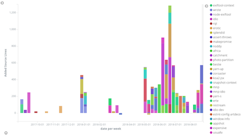

# daily-log

[](https://npmjs.org/package/daily-log)

`daily-log` is a collection of descriptions of work done each day.


<p align="center"><a href="#table-of-contents"></a></p>

## Table Of Contents

- [daily-log](#daily-log)
  * [Table Of Contents](#table-of-contents)
  * [API](#api)
    * [`dailyLog(arg1: string, arg2?: boolean)`](#dailylogarg1-stringarg2-boolean-void)
- [2018](#2018)
  * [September](#september)
    * [18 Tuesday](#18-tuesday)
    * [17 Monday](#17-monday)
      * [`Hello`](#hello)
      * [`World`](#world)
    * [17-24 Week Plan](#17-24-week-plan)
    * [13 Thursday -- 14 Friday](#13-thursday----14-friday)
    * [12 Wednesday](#12-wednesday)
    * [11 Tuesday](#11-tuesday)
    * [10 Monday](#10-monday)
      * [`artd.eco`](#artdeco)
      * [`npm.sucks`](#npmsucks)
      * [`git.sucks`](#gitsucks)
      * [`git.live`](#gitlive)
      * [`dailylog.co`](#dailylogco)
    * [7 Friday](#7-friday)
    * [6 Thursday](#6-thursday)
    * [5 Wednesday](#5-wednesday)
  * [TODO](#todo)
  * [Copyright](#copyright)

<p align="center"><a href="#table-of-contents"></a></p>

## API

The package is available by importing its default function:

```js
import dailyLog from 'daily-log'
```

### `dailyLog(`<br/>&nbsp;&nbsp;`arg1: string,`<br/>&nbsp;&nbsp;`arg2?: boolean,`<br/>`): void`

Call this function to get the result you want.

```js
/* yarn example/ */
import dailyLog from 'daily-log'

(async () => {
  await dailyLog()
})()
```

<p align="center"><a href="#table-of-contents"></a></p>

# 2018


## September

### 18 Tuesday


I fixed the bug in the `@a-la/import` to allow importing from Babel-compiled packages. I also improved the tests by writing evaluation tests, where the transpiled code will be run in a new VM context, making sure that it does work, rather than just to see what it looks like. This testing strategy is a high-level integration test and allows to be sure that modules will be exported and correctly.

There was some other business to attend to therefore no more programming was completed. In the evening, I switched off one of the virtual machines on Amazon which was used only to display the stats of how much work I had done in Kibana gathered by `analyse-package`, such as added lines of source, documentation, tests, number of commits and releases. In future, this will be part of the _MNP_.



I also set up a new VM on Azure, where the cost is £10 per month, and I get a free tier. I installed a Dokku container there, which allows to run websites. I pointed `artd.eco` and `alamode.cc` domains to this VM, meaning that these websites are now working with "Hello World" message. I have done that with the namecheap.com free DNS, therefore I can also switch off Route 53 zones which cost £0.50 a month. The steps required to set up a static HTML served via HTTPS in a new Dokku app are currently repetitive:

1. Point DNS at namecheap.com to the Azure's VM IP address.
1. Make a new package with _MNP_.
1. Copy a `Dockerfile` and `nginx.conf`.
1. Add a git remote, `git remote add dokku dokku@artd.eco:website.com`.
1. Push to git remote.
1. Login to the VM, add `letsencrypt` environment variable.
1. Run the `dokku letsencrypt` command against the app.

There are two ways to approach publishing a website, for example for ÀLaMode:

1. To create a separate repository in the organisation, e.g., `a-la/alamode.cc` specifically made for the website, and use a `website` _MNP_ package to create a basic version. It would also allow to run scripts such as adding a remote, creating an app and setting the letsencrypt flag before hand. _MNP_ could be modified to ask structure-specific questions such as a domain name.
1. To use existing package, such as `a-la/alamode` to have a website folder, in which all information can be put. That way, documentation from _Documentary_ could potentially be compiled in the website dir, and published online. The steps required to do that would be to to process more markdown, which is currently being taken care of by GitHub. It would also be possible to run example blocks and let visitors modify the input to functions to see how the output changes.

In comparison to GitHub pages, the advantage of putting a website in a HEAD branch is that there is no need to maintain a separate branch for the website. On the other hand, not even a simple server needs to be started when using GitHub pages.

Furthermore, it is uncertain which organisation to use for website packages. By putting them in the `artdecocode` organisation with Node.js packages, it makes the directory more crowded as there is less separation between packages and website. This could be solved by adding `artdecowww` `artdecoweb` organisations, for instance. The organisation could also be kept the same, but a different folder is used. By providing a question for the default structure during _MNP_ initialisation, all new packages could be setup to be websites by default.

[](https://docks.cc)
There is also a possibility for the `docks` software which would allow to control via a web-interface and CLI all the running Dokku apps, and in future even spawn new virtual machines. Unfortunately, the `docks` package is taken, but the namespace `@docks` is free. On GitHub, the org seems also to belong to an inactive account. By providing a web-interface, the whole process of managing apps could be simplified and abstracted so that no knowledge of the fact that it is based on Dokku is required. It could then be expanded to platform providers such as Heroku as well.

**FUTURE**

- [ ] Fix a bug in ÀLaMode when a completely empty file is processed.
- [ ] Implement `yarn doc commit message` to automatically push the committed changes.
- [ ] Add `node-exiftool` to _Documentary_ to add copyright metadata to images.
- [ ] Add a feature to _Documentary_ to be able to compile a text in SVG with a given font via spawning Chrome and drawing on canvas, therefore it should be a plugin since it's an advanced functionality which would require additional dependencies such as `Chrome Launcher`.

<p align="center"><a href="#table-of-contents"></a></p>

### 17 Monday

_Added: 17 Sep 2018 23:54_

It was nice to see the climb in the download count of _Documentary_, which reached 600+ weekly downloads. It is much more than last week, and possibly because more tags were added.

<a href="https://npmjs.com/package/documentary"></a>

Tags are important for discoverability, therefore I think the increase in downloads might have been because of the `table of contents` tag.


It would be useful to be able to see at which position in the search a package is against each of its tags. For the `documentation` tag, _Documentary_ is currently somewhere around 400 position, although it's a really great package. However, when it becomes more popular the position will improve as well, as the score is partly calculated according to popularity. _MNP_ should be able to analyse the tags, and it could be possible to install an image on a package page, which would call the _MNP_ server and tell the referrer of the page (i.e. which page people came from). This would show the search query and tags that people found the package from. I am not 100% sure it's technically possible, but there does not seem to be a proxy for an image, like it is on GitHub to prevent this sort of spying. Although it might be unethical, the method is only proposed to analyse and improve the marketing of packages using tags, and is not intended to breach privacy. In any way, NPM has a way to protect against this, but they never will because NPM sucks big time. Just the fact that they had to use somebody else's search engine for packages on their own website shows how desperate the company is.

<p align="center"><a href="#table-of-contents"></a></p>

| <a href='https://github.com/artdecocode/documentary'></a> |
| ------------------------------------------------------------------------------------------------------------------------ |
| 17 September is a good day to release `documentary@1.17`.                                           |

Today was a good and productive day, when I focussed on the **essential** work to implement linking of `@typedef` titles across the whole documentation. This feature was needed to continue with `@idio/core` to describe different sections of the configuration in multiple sections of the documentation, but be able to link to them from the overall, combined configuration.

`import('NodeJS').JavaScript` __<a name="javascript">`JavaScript`</a>__

__<a name="hello">`Hello`</a>__: When life gives you lemons, make a lemonade.

__<a name="world">`World`</a>__: Freedom (n.): To ask nothing. To expect nothing. To depend on nothing.

|      Name      |            Type             |                                          Description                                          | Default |
| -------------- | --------------------------- | --------------------------------------------------------------------------------------------- | ------- |
| __integrity*__ | [_Hello_](#hello)           | Integrity is the ability to stand by an idea.                                                 | -       |
| __evidence*__  | [_JavaScript_](#javascript) | The hardest thing to explain is the glaringly evident which everybody has decided not to see. | -       |

I started working on implementing this feature _Documentary_ by writing tests. I realised that the tests could be improved as well which was a work in progress, when instead of re-writing the same code many times to test different inputs for the same transformation, I used _Zoroaster_ masks. I then also improved _Zoroaster_ to be able to read the stream automatically, and compare it to a masks output.

<a href="https://github.com/artdecocode/zoroaster"></a>

The example below shows how easy it is to write tests now. The mask tests for the binary (the actual program to be run) _now_ look like this with the `fork` property:

```js
import { makeTestSuite } from 'zoroaster'
import Context from '../context'

const ts = makeTestSuite('test/result/bin/index.js', {
  fork: Context.DOC,
})

export default ts
```

Whereas before, it would be a bit longer:

```js
import { resolve } from 'path'
import { makeTestSuite } from 'zoroaster'
import Context from '../../context'

const path = resolve(__dirname, '../../mask/bin/index.js')
const ts = makeTestSuite(path, {
  /**
   *
   * @param {string} input
   * @param {Context} context
   */
  async getResults(input, { doc }) {
    const [source, ...args] = input.split(' ')
    const { stdout } = await doc(source, ...args)
    return stdout
  },
  context: Context,
})

export default ts
```

And even before `masks`, despite being innovative in using test contexts, it was very repetitive:

```js
import { ok } from 'assert'
import SnapshotContext from 'snapshot-context'
import Context from '../../context'

/** @type {Object.<string, (c: Context, s: SnapshotContext)>} */
const T = {
  context: [
    Context,
    SnapshotContext,
  ],
  async 'generates correct markdown'(
    { SNAPSHOT_DIR, doc, README_PATH }, { setDir, test },
  ) {
    setDir(SNAPSHOT_DIR)
    const { stdout } = await doc(README_PATH)
    await test('bin/markdown.md', stdout.trim())
  },
  async 'generates correct markdown from a directory'(
    { SNAPSHOT_DIR, doc, README_DIR_PATH }, { setDir, test },
  ) {
    setDir(SNAPSHOT_DIR)
    const { stdout } = await doc(README_DIR_PATH)
    await test('bin/dir-markdown.md', stdout.trim())
  },
  async 'generates correct markdown and saves it to a file'(
    { SNAPSHOT_DIR, doc, README_PATH, OUTPUT, readOutput }, { setDir, test },
  ) {
    setDir(SNAPSHOT_DIR)
    const { stdout } = await doc(README_PATH, '-o', OUTPUT)
    ok(/Saved/.test(stdout))
    const res = await readOutput()
    await test('bin/markdown.md', res.trim())
  },
  async 'prints the TOC with -t flag'(
    { SNAPSHOT_DIR, doc, README_PATH }, { setDir, test },
  ) {
    setDir(SNAPSHOT_DIR)
    const { stdout } = await doc(README_PATH, '-t')
    await test('bin/toc.md', stdout.trim())
  },
}

export default T
```

Test masks take out all the hassle of repeating the code required to set up a running test, and permit to focus on just supplying input data with its output counterpart.

In addition to `fork`, there are now `getTransform` and `getReadable` properties for the mask factory, which work in a similar way to the `fork` one:

```js
const ts = makeTestSuite('test/result/Documentary', {
  getTransform() {
    const doc = new Documentary()
    return doc
  },
})
```

Here, a _Transform_ stream is created which performs the main logic of the software, including embedding examples and outputs. The inputs are mapped to the outputs in the `test/result/Documentary` folder, which contains different files for different transforms, for example, a table.

````markdown
// replaces a table
The program accepts the following arguments:

```table
[
  ["arg", "description"],
  ["-f", "Display only free domains"],
  ["-z", "A list of zones to check"]
]
```

/* expected */
The program accepts the following arguments:

| arg |        description        |
| --- | ------------------------- |
| -f  | Display only free domains |
| -z  | A list of zones to check  |
/**/
````

>  A mask **factory** is a function which takes the location of the mask file on a computer and creates a mask test suite. It is called a factory because it is used to create objects according to certain process. In case of _Zoroaster_, an object is a test suite which contains any number of tests, or other test suites.

<p align="center"><a href="#table-of-contents"></a></p>

It was nice to work during the day, and it felt like actual work rather than a full-time hobby because I started at 9am rather than some random time I used to start in previous weeks. I feel more organise with proper planning, however I don't believe it's that important because I was doing a lot of work before planning as well. This means that although there's more structure, it does not mean that the end result is any better. It's just the attitude, and also allows to take things more seriously, i.e. I felt pretty much like at a job, with a short lunch break and some tiredness by 5:30, almost ready to go home (from home lol). Despite that, the feeling was very positive because of the fact that I am not working for somebody building what they want so that I can spend half of the money on rent _etc_, but doing what _I_ love to do, and what _I_ find important, that is, my company. There was a sense of connection with the world as well and other people because everybody is just doing what they can. It's really this expanded perception from bird-view that is related to the awareness of how everything on the planet and in both human and animal societies is connected. It might be called collective unconsciousness because we all exist together and there is always cause and effect. To perceive this is like to slow down time and be able to take in the more general view of the whole planet. However, it might be just a trick of the mind due to fatigue.

Finally, I also fixed a bug in `mismatch@1.0.3` necessary to implement masks. This brings the number of releases today to solid 3. Moreover, I found an important bug in _À La Mode_ which needs fixing. This will allow me to update _À La Import_ package in which the bug is present to the latest _Zoroaster_ and make the best use of the new masks.

 I also thought about marking ideas for the Art Deco package, and realised I could add a note when packages are installed, so that those 600 downloads of _Documentary_ would have shown 600 messages promoting Art Deco package in a form similar to "Thanks for choosing _Documentary_. It is part of Art Deco packages which include a modern context-testing framework _Zoroaster_ and a regex-based transpiler _À La Mode_. Are you tired of Babel and Mocha with 6000 dependencies? Stand out from the crowd by starting to use Art Deco packages".

**FUTURE**

- [ ] Fix the `import default, { named } from 'package'` bug in _À La Mode_.

**TIME**


### 17-24 Week Plan

_Added: 17 Sep 2018 09:10_

The `daily-log` has allowed to see the progress being made each week, with the structure of the workflow emerging. Now, to enhance the productivity even more, I will plan a week ahead. Although things might not go as planned, it is good to put down a general vision for the work that needs to be covered.

This week can be structured in the similar way as the last one, with 2 days working on _SvAG_ + _Documentary_, then one-two days on _Demimonde_ research, and finally getting back to _Zoroaster_ and _À La Mode_.

**ESSENTIAL**

- _SVaG_: make a terminal package to print terminal output in a window, i.e., fork https://github.com/F1LT3R/ansi-to-svg, or rewrite manually.
- _Documentary_: integrate the `@svag/terminal` package to be able to print output as an image.
- _Documentary_: implement some form of caching.
- _Zoroaster_: document masks and write a good example of using test contexts (create a `zarathustra` package).

- _À La Mode _: write the transpilation on-demand feature which would evaluate the code first and find instances of `import` and `export` this way.
- _Demimonde_: create a "brand" website to find out how it could benefit from using `demimonde`. This will go in the pitch desk.

**WORK**

- _Documentary_: extract all `@typedefs` first to be able to link them across the whole README.
- _Idio_: get back to finishing off the documentation written for the `@idio/core`, publish it.
- _Rqt_: make use of `@idio/core` in testing by updating the `https-context`.
- _Expensive_: Use the new `@rqt/rqt` in the project, and allow to fetch Whois data.

**DEVOPS**

- Migrate from Route 53 to the NS1 to cut the costs.
- Switch off some servers as now using Azure, look into a green hosting provider.

**LABS**

- An integration service for GitHub to automatically compile documentation server-side (not on a dev laptop). This would save time and allow only to push without having to run `yarn doc` command.
- The `moderne` tool which runs a server and monitors changes to the files, etc.
- `xml` transform for `@a-la/alamode` which would allow to write JSX-like syntax in code. This could then be used in `@svag` packages.

---

With the _Art Deco_ JavaScript, it looks like the project could be ready for a good start soon. When _Documentary_ receives an animated terminal, _Zoroaster_ gets a well-composed example, and _À La Mode_ can transpile files on-the-fly, the functional part of the product comes to the release of the first version. It will be time then to think about which domain name to use for the concept, and devise a marketing plan for the best launch. However, it might have to wait before the work in the `labs` section gets implemented, including the `moderne` package, because it seems that it might be an essential part of the project.

<p align="center"><a href="#table-of-contents"></a></p>

### 13 Thursday -- 14 Friday

Today I decided to complete the update for _Pedantry_ to be able to compile the blog correctly in the descenting order by date. It was implemented using a natural sort available in JavaScript therefore it wasn't complicated. Other features included adding a single new line or a blank line (two new lines) between each file read by _Pedantry_.


After that, I worked on updating the documentation for _Documentary_ to re-organise the sections and make the features more prominent. The fork feature got its own section, and the documentation now begins with the **key features** so that anyone who accesses the package can see its advantages straight away. In addition, I looked for some Art Deco images to add to each feature, and found a few [free fonts](https://www.1001fonts.com/art-deco-fonts.html), some including *borders* and *dingats*. There is also a nice [Art Deco](https://www.1001fonts.com/aerovias-brasil-nf-font.html) font used for the logo of this post.


There was also an ornaments font:


It inspired me to use symbols from it as separators for each section in documentations. It worked really well by dividing the space, making it more clear when sections come to an end (especially important for larger sections with sub-sections), and can be used to jump back to the table of contents.

By the morning, when I wrote description of the section breaks, something unexpected happened -- _Documentary_ stopped working and didn't output the correct README file. Having spent a few hours debugging it, the conclusion was a groan "I don't why it is not working... agggrh". When the part with the description of the section breaks was taken out completely, or a few lines from it were removed, _Documentary_ worked again. The general idea was that there was too much data, which might not have been the problem before as there's an internal buffer, but could have become now when this buffer overflowed. And so I went to sleep.

> TIMER: 8.30 (without browsing for fonts, extracting SVGs)

<p align="center"><a href="#table-of-contents"></a></p>

_Documentary_ works in 2 stages: first, it creates a stream of data from a directory with separate files. It pipes that stream into a _Toc_ generator, which extracts the titles so that it can construct the table of contents. The second stage is run afterwards, because when we see the `%TOC%` marker, we need to replace it with the table of contents, therefore we have to scan the whole document for headings first. But because I wanted to reuse the stream of data for both documentation and the Toc, I piped it into a dummy proxy stream, and paused it, and unpaused when the Toc was ready. The idea was that it would accumulate all data in a buffer, which would then be allowed to flow when the Toc is built. There was no problems with it before, but when there was too much data, it stopped working.

>  A proper reconstruction of the issue described above should be constructed to fully understand the underlying processes.

The solution was to be generous and create a new stream of data from a directory rather than trying to reuse a buffered one. It worked right away after the implementation as well. The good point is that some other parts of the software were rewritten for easier understanding and maintenance in the future.

<p align="center"><a href="#table-of-contents"></a></p>

When I tried to compile _Documentary_ with _Alamode_, I faced a problem that the svg image files were also processed by the transpiler, which in addition added source maps to it. This shouldn't happen because only JS and JSX files need to be processed by it. Therefore, _Alamode_ also required an update which was added to it.

To improve testing, a `test-context` package was created, and 2 new packages added, including `@wrote/rm` and `@wrote/clone`. The `@wrote/clone` is also used in the _Documentary_ to copy the section breaks images into the repository which uses them, however there was an issue with `@wrote/ensure-path` when paths for both images were being recursively created at the same time in parallel. This was an old problem faced even a year ago with `wrote`. I finally fixed it.

<a href="https://en.wikipedia.org/wiki/L%C3%A9on_Bakst"></a>

For the [`wrote`](https://github.com/wrote) org, which is a set of packages to work with the filesystem, I added a logo and found a good domain name. The logo is by Léon Bakst who was a Russian painter (January 27, 1866 -- December 27, 1924). And we share the birthday date! He was also born in Hrodna, Belarus - an area where my dad comes from.

It is really interesting how orgs and package name spaces can work so well together. The scopes look good as well, and I need to find a scope for test contexts, such as `@context/temp` rather than `temp-context`. To me, these two look as version 2 against version 1. And MNP is great at allowing to create packages with scopes and orgs.

**NEW PACKAGES**

- [`temp-context`](https://github.com/wrote/temp-context): provide each test with a new temp folder, which is a blank sheet (thx 🇰🇪 for the analogy) on which a test can write. At the end of the test, a snapshot of the sheet can be taken to compare against expected results.
- [`@wrote/rm`](https://github.com/wrote/rm): delete a file or a directory.
- [`@wrote/clone`](https://github.com/wrote/clone): clone a file or a directory.

**FUTURE**

1. Automatic section breaks, without the need to explicitly add them.
1. Create `fs-context` to work with the filesystem (e.g., read files and assert that they exists) which the `temp-context` can then extends.

> TIMER: 10 hours

<p align="center"><a href="#table-of-contents"></a></p>

### 12 Wednesday

Today I continued the research on Demimonde, and made an offer for the domain name I want. Gladly it is for sale and although the price is more than a few thousand, it is a reasonable price for that domain. Here is a link to some [notable sales](https://www.gritbrokerage.com/notable-sales).

```
Wear.co -   $19k   (Nov 2016)
Acorn.me - $19k (Aug 2018)
Fort.co - $18k (Oct 2016)
Range.co - $18k (Jan 2018)
HUV.com - $16,100 (Mar 2018)
Toolkit.co - $15k (Aug 2018)
Output.co -   $15k   (Mar 2016)
Roam.co -   $15k   (Dec 2015)
Vesper.co - $15k (June 2017)
Curate.co - $14k (Jan 2018)
```

Because I was compiling the list of different companies in a table, I had to realise the idea from a while ago for _Documentary_ to create a template for a table, and populate it with values. The template is called a macro and allows to remove repetitive information from the table and greatly simplify the task of putting data together.

Along the way to the release, the tests were rewritten as _Zoroaster_ masks instead of cumbersome snapshots, and a few bugs such as partial inline code toc-titles fixed. The generated tables are now also formatted to make the content appear as in a table, and although the `README.md` is not meant for humans anyway, it is a nice touch. It does not work so well with wide tables and word-wrap however the word wrap can be switched off. Another bug with the simplest method title was also fixed and writing tests with masks is a pleasant experience.

````markdown
%TOC%

```## methodTitle
```

## Packages

%TABLE-MACRO Packages
**[$1](t)**, [$1](https://artdeco.bz/$1), $2
%
```table Packages
[
  ["Name", "Link", "Downloads"],
  ["zoroaster", "300"],
  ["documentary", "500"],
  ["mnp", "1000"]
]
```
````

```markdown
- [`methodTitle()`](#methodtitle-void)
- [Packages](#packages)
  * [zoroaster](#zoroaster)
  * [documentary](#documentary)
  * [mnp](#mnp)

## `methodTitle(): void`

## Packages

|         Name         |                     Link                      | Downloads |
| -------------------- | --------------------------------------------- | --------- |
| **<a name="zoroaster">zoroaster</a>**   | [zoroaster](https://artdeco.bz/zoroaster)     | 300       |
| **<a name="documentary">documentary</a>** | [documentary](https://artdeco.bz/documentary) | 500       |
| **<a name="mnp">mnp</a>**         | [mnp](https://artdeco.bz/mnp)                 | 1000      |
```

_Zoroaster_ was updated to be able to construct mask tests not only from a single file, but from a directory. Mask testing is a bit like snapshot-testing, but it defines a function to run against each input to transform it into an output, and an unlimited number of inputs and their respective outputs are defined in a mask file. For example, a mask could be:

```js
// does not replace titles in the the inner code
`[Hello World](t)`

/* expected */
`[Hello World](t)`
/**/

// replaces a title link with an anchor
[Hello World](t)

/* expected */
<a name="hello-world">Hello World</a>
/**/

// replaces a title link with inner code
[`Hello World`](t)

/* expected */
<a name="hello-world">`Hello World`</a>
/**/
```

Here, there are 3 tests defined in terms of input and output. They all share the same test function which is defined in _Zoroaster_'s `makeTestSuite` config as `getResults`. The test will just create a _Documentary_ stream and run it against the input, and then return the string so that it can be compared to the output. The context is just a convenient place to store methods for testing.

```js
import { makeTestSuite } from 'zoroaster'
import { resolve } from 'path'
import Context from '../../context'

const ts = makeTestSuite(resolve(__dirname, '../../mask/Documentary'), {
  /**
     * @param {string} input
     * @param {Context} context
     */
  async getResults(input, { Documentary, catchment }) {
    const doc = new Documentary()
    doc.end(input)
    return await catchment(doc, true)
  },
  context: Context,
})

export default ts
```

When the tests are run, each mask test will ensure that the program produces correct output for the given input. It is called a mask because we use the test input as a mask for the program, i.e., because the program maps the input space into the output space (such as that x1 is transformed into x2 in a certain way), by changing the input we're moving the mask in a particular direction to see the output and discover the behaviour of the program. By looking at this behaviour from different viewpoints, we ensure that the software works as intended. Mask testing removes the need to repeatedly write the same code in tests of the same algorithm, and allows to focus on mapping inputs to the outputs. The difference between that and snapshot testing is that snapshot testing only remembers the output of the test in a file, whereas mask testing also allows to skip writing the test bodies.

```fs
$ NODE_DEBUG=doc zoroaster -a test/spec/mask/Documentary.js
 test/spec/mask/Documentary.js
   toc-titles.md
    ✓  does not replace titles in the the inner code
    ✓  replaces a title link with an anchor
    ✓  replaces a title link with inner code
```

Finally, I made a proper fork of `clean-stack` as `@artdeco/clean-stack`. It's a first package in the `@artdeco` scope, however it could also be called `error-stack` which is free. It also turned out to be a bit of an adventure, because after creating a new package with _MNP_ (and copying the implementation and licence but nothing else, because I wanted to have my package structure) and publishing it in the namespace, I deleted the forked repository on the web and replaced it with the newly created one by renaming it.

This lead to an unexpected problem that `yarn` was not able to install other packages, because I referenced the dependency in published packages as `clean-stack#82625bf`, but after the repository was deleted, the package could not be installed. This means that anyone who tried to install any package that had `clean-stack` in its dependency graph (including `documentary`, `restream` and thus `node-exiftool`) would fail in trying to do so and see an error message.

The problem was an interesting one and I anticipated that I might run into trouble earlier when publishing with a reference to a GitHub commit. What I should have done was to publish a fork on _NPM_ right away, however it was much easier to install by the commit hash. Because the the package was also deleted locally with `rm -rf`, there was no way to get the old git tree back, and GitHub showed `unknown_repository` in the pull request:


One possible solution was to contact GitHub via email and explain the situation however that would take some time. Therefore, I had to clone the repository from the PR and likely there's [a way to do it](https://stackoverflow.com/questions/14947789/github-clone-from-pull-request): `git fetch origin pull/<#>/head:<local_branch_name>`. Nietsche bless the stackoverflow and git for this possibility. After restoring the branch that way, it was easy to make the commit available again at `artdecocode/clean-stack`, but it also means that now the fork has to start from that point so that anyone who's using any version of software dependent on the commit-based `clean-stack` would not be able to do it. Not a big deal, and a learning outcome. In contrast, if I published to _NPM_, the package would always have been available. The good point however is that the commit hash is unique and it is impossible to tamper with it which means that no other code could have been substituted for it.

In conclusion, I updated every package that used `clean-stack`, including _Erotic_, _Catchment_, _Restream_, _Zoroaster_ and _Assert-Throws_, so that all of them now depend on the `@artdeco/clean-stack` scoped version of the package. Again, It was a lot of manual labour which could be eliminated with a `veg` package or a service, to keep the dependencies green automatically. However, one point is that even if a dependency is not specified in `package.json`, the tests could still pass if a dev dependency has it. For example, if I removed `clean-stack` from _Catchment_ and used `@artdeco/clean-stack`, but didn't update the code, the tests would still pass because maybe _Erotic_ has installed `clean-stack`, and it would be found in the `node_modules` folder.

Tomorrow, I will do more research for Demimonde to give fuller descriptions of current companies.

**FUTURE**

- [ ] Write documentation in _Zoroaster_ for mask testing.
- [ ] Create `error-stack` package which could be used to remember async error stacks (instead of _Erotic_).
- [ ] Describe the problem of having packages in `devDependencies` which are required without an error in the source code, making the tests pass but possibly also breaking the software. It can be done on the linting level, however what about CI?

> Timer: 6.30 + 6.12 = 12.42 hours

<p align="center"><a href="#table-of-contents"></a></p>

### 11 Tuesday

Market research for _Demimonde_ and coming up with ideas.

<p align="center"><a href="#table-of-contents"></a></p>

### 10 Monday

When checking out the repository on the phone using mobile Safari, the image did not look sharp, because the filter made it into a raster and the quality was lost. The fix was to implement the shadow as a separate element. The problem did not arise on the desktop because images were not resized, however now with the example below it is clear that it could also have happened for larger images.

<table>
<thead>
 <tr>
  <th>
   Shadow On Window
  </th>
  <th>
   Standalone Shadow
  </th>
 </tr>
</thead>
<tbody>
  <tr>
   <td>
   
   </td>
   <td>
   
   </td>
  </tr>
</tbody>
</table>

<a href="https://github.com/artdecocode/daily-log/blob/master/shadow.md"></a>

There were a number of solutions that were thought about and tried out.

1. Using the CSS filter to create a shadow. The GitHub's sanitiser actually allows to have the `<style>` tag inside of the CSS. The box-shadow did not work, therefore the `filter: box-shadow()` had to be used. This worked fine on the browser, however did not work on the phone. As it turns out ([Why is filter(drop-shadow) causing my SVG to disappear in Safari?](https://stackoverflow.com/questions/36705323/why-is-filterdrop-shadow-causing-my-svg-to-disappear-in-safari)) there's a bug in older Safari which prevents the `-webkit-filter: drop-shadow` from working. Also interestingly, the sanitiser removes the `-moz-filter` property from the style.

    ```css
    svg {
      -webkit-filter: drop-shadow(0 22px 20px rgba(0, 0, 0, 0.5));
      -moz-filter: drop-shadow(0 22px 20px rgba(0, 0, 0, 0.5));
      -ms-filter: drop-shadow(0 22px 20px rgba(0, 0, 0, 0.5));
      filter: drop-shadow(0 22px 20px rgba(0, 0, 0, 0.5));
    }
    ```

1. Trying to emulate the gradient using the `radial-gradient`. This also does not work because the radial gradient cannot be rectangular as first thought. <br/>
   
<br/>There was a proposal ([Advanced Gradients for SVG](http://www.svgopen.org/2011/papers/18-Advanced_Gradients_for_SVG/)) by _Tavmjong Bah_ who is a developer / documenter (nice job) at Inkscape to include more complex gradients, and it looked really cool, however it never ended in the spec. Great work Tavmjong nevertheless ⭕ The article really shows how pro some people are.<br/>
    
<br/>Then I was considering applying a transform to the radial gradient, e.g., skewing or a matrix, however it's too complicated. Adding multiple shapes with its own gradient such as 4 circles on corners and rectangles inbetween seems complex as well, as there's no straight forward understanding as how they would look together.

1. Thinking about generating a single array of dots for the shadow, and filling with radial gradients between corners. This would make the filesize large, however is a possible solution.

1. Finally, the real solution which comes as an insight, is to only apply the shadow only to a separate element. Because the mobile browser would resize this one separately from the main window, the window would not be rasterised and would look fine. This proved to be true. 🎸

```svg
<g filter="url(#shadow)" transform="translate(55, 25)">
  <defs>
    <filter id="shadow" width="132%" height="180%" x="-16%" y="-19%">
      <feOffset dx="0" dy="25" in="SourceAlpha" result="so"/>
      <feGaussianBlur in="so" result="sb" stdDeviation="27.5"/>
      <feColorMatrix in="sb" result="sm" type="matrix" values="0 0 0 0 0   0 0 0 0 0   0 0 0 0 0  0 0 0 0.5 0"/>
      <!-- The merge is actually removed in the later version -->
      <feMerge>
        <feMergeNode in="sm"/>
        <feMergeNode in="SourceGraphic"/>
      </feMerge>
    </filter>
  </defs>
  <rect width="360" height="132" fill="white" rx="6" />
</g>
<g id="the-window">
  <!-- code for drawing the window -->
</g>
```

Time spent on the problem: ~3 hours.

**TODO**

1. Update `pedantry` to allow reverse reading of files (e.g., for this blog to start from the last day every time to show most recent items)
1. Update `pedantry` to parse the number before each file properly to prevent `11` going before `2`.
1. Update `svag` packages to use correct shadow without loosing quality.
1. ~~Add screenshots here from the iPhone to show poor quality.~~

<hr/>

First thing after sleep was to register the <a name="artdeco">`artd.eco`</a> domain which I absolutely love. This is one of the best things I've ever registered. Happy happy happy. I might save up $3000 and buy `artdeco.io` later since it seems to be the only available and somewhat affordable one.

The second part of the day was spent on implementing the shadow in the `@svag` org by updating the library as well as other packages. Some extra attributes could be omitted as they had a default value (e.g., gradient starting at `y=0%` and same for the line behind the toolbar, `x=0`).

The `@svag/lib` was improved in version 2 for better `makeElement` signature which would take the name of the element as the first argument as it was compulsory anyway. The `rect` element was added and its documentation copied from the MDN website, however in future this process can be automated. The `@svag/toolbar`, `@svag/shadow` and `@svag/window` were updated to use the newer version of `makeElement`, and some TODOs were fixed in them as well, such as absolute paths to the SVG files. The `@svag/shadow` was also updated to be a separate element to prevent the loss of quality of resize, and incorporated into the `@svag/window`.

The `@svag` packages can benefit from `alamode` implementing a transform to parse `xml` in the same way as `jsx` parsing works. This means that the code could be transformed into a developer friendly version, e.g., instead of writing

```js
const rect = makeElement('rect', {
  width: 10,
  height: 20,
})
```

it would be possible to write

```jsx
const rect = <rect width={10} height={20}/>
```

which would be absolutely amazing if done with `alamode` (it was one of the goals of the regex transpiler project from the beginning). The source maps could be hard to implement but we love challenges.

The shadow was implemented, and even improved by removing merging it with the window element, so that the window which produces the shadow is transparent and only the shadow is visible. This ensures that it looks very clear on the mobiles.


There is a domain zone `.sucks`. This would be suitable for <a name="npmsucks">`npm.sucks`</a> because for some reason they don't support relative urls on the `@svag` packages. Initially I thought it was the case due to trying to embed SVGs but it also does not work with PNGs. This could be because the org was named `svagjs` before, however I'm not sure. +1 in the list of things why `npm` sucks. The domains are expensive however, ~$260.

**<a name="gitsucks">`git.sucks`</a>** After implementing the shadow, I was so exhausted by all the chore jobs that I had to do such as linking the scoped packages so that they can interact together, building them when needed, documenting and building documentation, reverting commits when things went wrong, running `build` and `test-build` before releasing multiple times, unlinking packages, installing new versions so that they can be tested, writing changelog messages _etc_. I realised I use `git` command to much, and instead of coding have to deal with all the unnecessary manual work. What I really want to do is:

1. Code
1. Test
1. Document

The mostly `build` and `commit` phase should be taken out of the process completely. There should be a new branch for a feature in each of the relevant packages, which would get updated w/ build and doc automatically, and then merged when everything is ready in other packages, which would then unlink the package and install it from the NPM to test against the published version. I produce a lot of commits and my motto is `commits are free` because it doesn't really matter how many commits there are. But also, if it doesn't matter, there should be no reason why I couldn't do with a single commit for a feature. Or there could be at least multiple commits for different parts of the code, but there should not be manual commits for any of the `build` jobs, be it the code or documentation. I think `moderne` is the package which could do it, however it's not just the question of using a package, but of organisation of work and habits, therefore I'm still trying to come up with requirements. Some of them are:

1. Define a group of packages, e.g., `@svag/window`, `@svag/lib`, _etc_.
1. Create a git branch for each of them when working on a new feature.
1. Link the packages together.
1. Monitor changes to the code, build and run tests against build. Also build documentation.
1. Keep pushing to GitHub whenever new code is ready. There should be no manual git push and the `git` command should be forgotten.
1. Possibly there should be a plugin for VS Code which would show the status of the group, however this can be done in the CLI as well.
1. Possibly a GUI interface to prepare a merge and publish, with a changelog message, however this could also be done in the CLI.
1. Unlinking packages and installing published versions, taking them off the stack one by one.

<a name="gitlive">`git.live`</a> should allow to focus on actual coding and not writing commit messages and force pushing to the remote. It's really tiring. The problem is probably met by other developers as well, and it could be a great tool to make. `documentary` is actually somewhat solving it for documentation by allowing to reset commits and push new versions automatically, however there's still no support for updating examples and including them in commits. `moderne` would then extend this logic to the `build` folder as well, although this could be done with `alamode --watch`.

The daily log could get its own domain, such as <a name="dailylogco">`dailylog.co`</a>. Gosh I love domains, especially `.co`.

**FUTURE**

- Add the `xml` parsing in ALaMode via `jsx` module loader.
- Implement the watch mode in `alamode`.
- Watch and auto-commit changes to examples in `documentary`.

> Timer: 9.30 + 3.12 = 12.42 Hours

<p align="center"><a href="#table-of-contents"></a></p>

### 7 Friday

Viva la [`SVaG`](https://svag.co)! As continuation from yesterday's work on making a terminal SVG, I started the day by figuring out that the best course of action would be to create a package which would export multiple UI elements as SVGs. The elements can be dynamically generated, therefore a whole library was written. In the beginning, I just worked on the `svag` package and was putting lib methods and UI elements such as `terminal` in there, but quickly changed to registering a new organisation on `npm` [`svag`](https://www.npmjs.com/org/svag) and on GitHub, and used `mnp` to spawn packages.


The GitHub org name `svag` was taken, and the request to free it due to inactivity was denied as there was some private activity. I also got a 2-month old response saying that `artdeco` org is also not inactive, but I could try the trademark claim. Therefore, the org `svagjs` was registered although I'm not a big fan of adding `js` at the end because it's so easy, unless it's something like `mnpjs` because npm also uses `npmjs.com` and `mnp` is a play on `npm`.

After a while, I checked the domain names for `svag` and most of them were free, with `svag.net` and `svag.org` being for sale. The `svag.co` sounded really cool, despite the price for $130 for a premium name, therefore it was acquired, as `.co` domains are super nice. `Svag LTD` is not available to register as a company.

```js
Domain    Available  Premium  Price
svag.com     no
svag.net     no
svag.org     no
svag.biz     yes
svag.co      no         ✓     130.00
svag.cc      yes
svag.io      yes
svag.bz      yes
svag.nu      yes
svag.app     yes
```

Then I focused the efforts on implementing the library with some methods such as creating rounded corners in an SVG path and others, adding tests and documentation. Slowly progressed in order `lib` -> `toolbar`, `shadow` -> `window`. The `shadow` was initially called blur because it's the main filter used in it, but I didn't notice almost till the end. The `window` was also called `terminal` but it's just a generic `window`. Moreover, had to go back to `ansi-to-svg` to update the interface, and fixed the foreground/background bug from yesterday.

```js
import { writeFileSync } from 'fs'
import { roundedCorner, svg, makeElement } from '@svag/lib'

const drawPath = (from, to) => {
  const d = `M${from.x},${from.y} ${roundedCorner(from, to)}`
  const p = makeElement('path', {
    attributes: {
      d,
    },
  })
  return p
}
const corners = [
  drawPath({ x: 0, y: 50 }, { x: 50, y: 0 }),
  drawPath({ x: 50, y: 0 }, { x: 100, y: 50 }),
  drawPath({ x: 100, y: 50 }, { x: 50, y: 100 }),
  drawPath({ x: 50, y: 100 }, { x: 0, y: 50 }),
]

const g = makeElement('g', {
  attributes: {
    stroke: 'green',
    fill: 'red',
    'stroke-width': '2',
  },
  content: corners,
})

const image = svg({
  content: makeElement('g', {
    attributes: {
      transform: 'translate(2,2)',
    },
    content: g,
  }),
  width: 110,
  height: 110,
  stretch: false,
})

console.log(image)
writeFileSync('images/rounded-corners.svg', image)
```

```svg
<svg version="1.1" xmlns="http://www.w3.org/2000/svg" xmlns:xlink="http://www.w3.org/1999/xlink"
     viewBox="0, 0, 110, 110" width="110px" height="110px">
  <g transform="translate(2,2)">
    <g stroke="green" fill="red" stroke-width="2">
      <path d="M0,50 C 0 25, 25 0, 50 0"/>
      <path d="M50,0 C 75 0, 100 25, 100 50"/>
      <path d="M100,50 C 100 75, 75 100, 50 100"/>
      <path d="M50,100 C 25 100, 0 75, 0 50"/>
    </g>
  </g>
</svg>
```

Trying to use `I` in the log, although it does sound more personal, but I'm not gonna write `we` because it's too formal.


There's an [`asciinema`](https://asciinema.org/) project which allows to play terminals as `svg` animations, however the purpose of `SVaG` is to provide dynamic UI elements.

**FUTURE**

1. Implement the terminal output into the simple window.
1. Animate the terminal output.
1. Embed `@svag/window` into documentary when the terminal is ready  (possibly as a plugin rather than dependency?), because waiting on `ansi-to-svg` to merge the PR can last forever, and we want our own package to do that, it's not difficult.
1. move the `clean-stack` to art deco scope as still waiting on the PR to get merged.

> Timer: (10.5 - 5.3 = 5.2) + (7.28) = _12 hours 30 min_

<p align="center"><a href="#table-of-contents"></a></p>

### 6 Thursday

The day started by continuing to find suitable packages to compile w/ `documentary`. [`json2svg`](https://www.npmjs.com/package/json2csv) looked good yesterday, however it had a screenshot of a PNG. Therefore it was decided to be a great feature for _Documentary_ to make screenshots of output from a terminal. The search revealed existence of [`ansi-to-svg`](https://github.com/F1LT3R/ansi-to-svg) which is not very popular, but amazing. To start off with, a [Yosemite UI Kit](https://www.sketchappsources.com/tag/yosemite.html) for Sketch was downloaded and the title bar exported as SVG.

Because the export was automatic and auto-generated, `Sketch` produced some output which could be simplified by hand. Updated the SVG file and made it a template for the `ansi-to-svg` which also required modifying the source code. Creating a `package.json` script for running tests on commit is hell and should not be allowed.

Finished off with a complete good-looking terminal template which could also be used as a stand-alone package. Allows to either have or not have shadows. Learnt some things about drawing SVGs such as creating paths (e.g., for rectangles with rounded corners) and blurs (along with cases when having to specify `x`, `y`, `width` and `height` for those). _MOVE TO_ in path definition reminded of year 5 logo-worlds (???).

✍️ Started the daily log 🎉!


**Future** Integrate the terminal generation into _Documentary_, make animated terminal in addition to static, release as a separate package (`svag`?). Implement caching for _Documentary_.

1. Timer: 8.38 + (5.3) = _13 hours 41 min_

<p align="center"><a href="#table-of-contents"></a></p>

### 5 Wednesday

Working on hiding error stack for the `restream` and starting to implement it in the `erotic`. Figuring out that Node.js [hides an async stack](https://github.com/nodejs/node/issues/11865) behind `<anonymous>`, but only if error was thrown after the first `await`.

```js
const after = async () => {
  await new Promise(r => setTimeout(r, 100))
  throw new Error('example error after await')
}

const before = async () => {
  throw new Error('example error before await')
}

(async () => {
  try {
    await before()
  } catch ({ stack }) {
    console.log(stack) // error stack is there
  }
})()

;(async () => {
  try {
    await after()
  } catch ({ stack }) {
    console.log('\n======\n')
    console.log(stack) // cuts at anonymous
  }
})()
```

```
Error: example error before await
    at before (/Users/zavr/adc/daily-log/example/promise.js:7:9)
    at /Users/zavr/adc/daily-log/example/promise.js:12:11
    at Object.<anonymous> (/Users/zavr/adc/daily-log/example/promise.js:16:3)
    at Module._compile (module.js:653:30)
    at Object.Module._extensions..js (module.js:664:10)
    at Module.load (module.js:566:32)
    at tryModuleLoad (module.js:506:12)
    at Function.Module._load (module.js:498:3)
    at Function.Module.runMain (module.js:694:10)
    at startup (bootstrap_node.js:204:16)

======

Error: example error after await
    at after (/Users/zavr/adc/daily-log/example/promise.js:3:9)
    at <anonymous>
```

- _Documentary_:
 + `v1.14`: refactor TOC, allow h1, detect underlined titles
 + `v1.13`: fork stderr
 + `v1.12`: replace require, start using masks
- _Restream_:
 + `v3.2`: brake and stack hiding.


**Future** Implement remembering the full async stack in `erotic`.

<p align="center"><a href="#table-of-contents"></a></p>

## TODO

- [ ] Add a new item to the todo list.

## Copyright

(c) [Art Deco][1] 2018

[1]: https://artdeco.bz

<p align="center"><a href="#table-of-contents"></a></p>