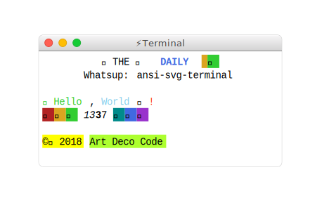

# daily-log

[](https://npmjs.org/package/daily-log)

`daily-log` is a collection of descriptions of work done each day.


## Table Of Contents

- [daily-log](#daily-log)
  * [Table Of Contents](#table-of-contents)
- [2018](#2018)
  * [September](#september)
    * [5 Wednesday](#5-wednesday)
    * [6 Thursday](#6-thursday)
  * [API](#api)
    * [`dailyLog(arg1: string, arg2?: boolean)`](#dailylogarg1-stringarg2-boolean-void)
  * [TODO](#todo)
  * [Copyright](#copyright)

# 2018


## September

### 5 Wednesday

Working on hiding error stack for the `restream` and starting to implement it in the `erotic`. Figuring out that Node.js [hides an async stack](https://github.com/nodejs/node/issues/11865) behind `<anonymous>`, but only if error was thrown after the first `await`.

```js
const after = async () => {
  await new Promise(r => setTimeout(r, 100))
  throw new Error('example error after await')
}

const before = async () => {
  throw new Error('example error before await')
}

(async () => {
  try {
    await before()
  } catch ({ stack }) {
    console.log(stack) // error stack is there
  }
})()

;(async () => {
  try {
    await after()
  } catch ({ stack }) {
    console.log('\n======\n')
    console.log(stack) // cuts at anonymous
  }
})()
```

```
Error: example error before await
    at before (/Users/zavr/adc/daily-log/example/promise.js:7:9)
    at /Users/zavr/adc/daily-log/example/promise.js:12:11
    at Object.<anonymous> (/Users/zavr/adc/daily-log/example/promise.js:16:3)
    at Module._compile (module.js:652:30)
    at Object.Module._extensions..js (module.js:663:10)
    at Module.load (module.js:565:32)
    at tryModuleLoad (module.js:505:12)
    at Function.Module._load (module.js:497:3)
    at Function.Module.runMain (module.js:693:10)
    at startup (bootstrap_node.js:191:16)

======

Error: example error after await
    at after (/Users/zavr/adc/daily-log/example/promise.js:3:9)
    at <anonymous>
```

- _Documentary_:
 + `v1.14`: refactor TOC, allow h1, detect underlined titles
 + `v1.13`: fork stderr
 + `v1.12`: replace require, start using masks
- _Restream_:
 + `v3.2`: brake and stack hiding.


**Future** Implement remembering the full async stack in `erotic`.

### 6 Thursday

The day started by continuing to find suitable packages to compile w/ `documentary`. [`json2svg`](https://www.npmjs.com/package/json2csv) looked good yesterday, however it had a screenshot of a PNG. Therefore it was decided to be a great feature for _Documentary_ to make screenshots of output from a terminal. The search revealed existence of [`ansi-to-svg`](https://github.com/F1LT3R/ansi-to-svg) which is not very popular, but amazing. To start off with, a [Yosemite UI Kit](https://www.sketchappsources.com/tag/yosemite.html) for Sketch was downloaded and the title bar exported as SVG.

Because the export was automatic and auto-generated, `Sketch` produced some output which could be simplified by hand. Updated the SVG file and made it a template for the `ansi-to-svg` which also required modifying the source code. Creating a `package.json` script for running tests on commit is hell and should not be allowed.

Finished off with a complete good-looking terminal template which could also be used as a stand-alone package. Allows to either have or not have shadows. Learnt some things about drawing SVGs such as creating paths (e.g., for rectangles with rounded corners) and blurs (along with cases when having to specify `x`, `y`, `width` and `height` for those). _MOVE TO_ in path definition reminded of year 5 logo-worlds (???).

✍️ Started the daily log 🎉!



**Future** Integrate the terminal generation into _Documentary_, make animated terminal in addition to static, release as a separate package (`svag`?). Implement caching for _Documentary_.

1. Timer: 8.38 + (5.3) = _13 hours 41 min_

## API

The package is available by importing its default function:

```js
import dailyLog from 'daily-log'
```

### `dailyLog(`<br/>&nbsp;&nbsp;`arg1: string,`<br/>&nbsp;&nbsp;`arg2?: boolean,`<br/>`): void`

Call this function to get the result you want.

```js
/* yarn example/ */
import dailyLog from 'daily-log'

(async () => {
  await dailyLog()
})()
```

## TODO

- [ ] Add a new item to the todo list.

## Copyright

(c) [Art Deco][1] 2018

[1]: https://artdeco.bz
